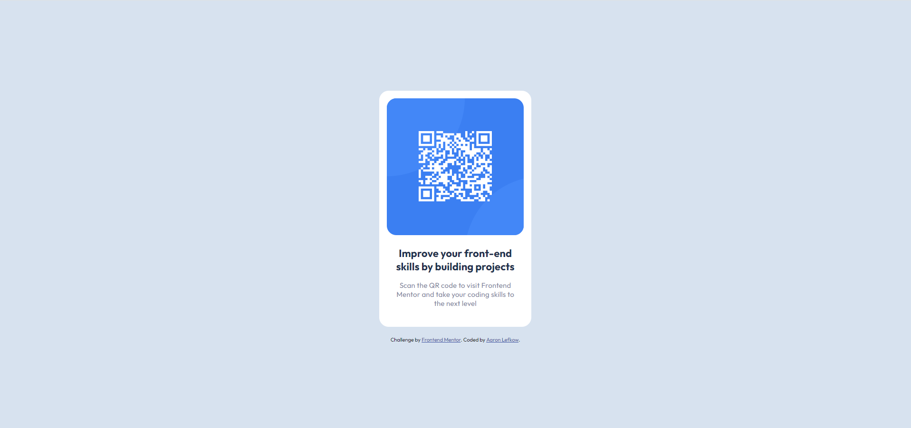
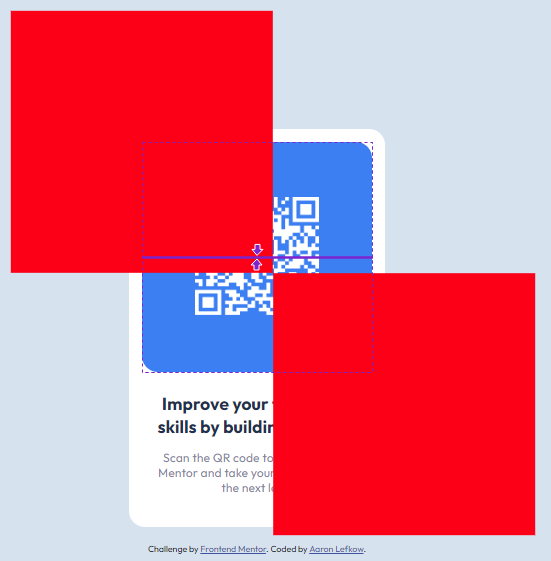

# Frontend Mentor - QR code component solution

This is a solution to the [QR code component challenge on Frontend Mentor](https://www.frontendmentor.io/challenges/qr-code-component-iux_sIO_H). Frontend Mentor challenges help you improve your coding skills by building realistic projects.

## Screenshot



## What I learned

I reinforced CSS Flexbox and using ::before and ::after. I also used a figma design project for the first time.

One thing I found particularly interesting was the below CSS:

```css
.qr-code-box::before,
.qr-code-box::after {
  content: "";
  background-color: #3d86fb;
  position: absolute;
  top: 0%;
  left: 0%;
  border-radius: 50%;
  z-index: 0;
  width: 32.8rem;
  height: 32.8rem;
}

.qr-code-box::before {
  transform: translate(-50%, -50%);
}

.qr-code-box::after {
  transform: translate(50%, 50%);
}
```

In the below image I turned off the overflow, border-radius, and changed the color red.


What I initially expected to happen was have the edges meet in the center of the QR code. However, they are a bit off from center.
From a udemy course I learned that ::before and ::after are actually in relation to the parent. In this case, the parent is the blue square.
The figma design file had the two squares having very different width and height but I was able to make it look very similar to the design using the same dimensions for each circle.
It was a very happy coincidence for me.

## Continued development

At the time of writing I was following the [Build Responsive Real-World Websites with HTML and CSS](https://www.udemy.com/course/design-and-develop-a-killer-website-with-html5-and-css3) course on Udemy and wanted to try another project to reinforce what I learned on Udemy. When I started this project I immediately related topics in the course to how I would need to build the qr-code component. Overally, the combination of both the course and completing a small project / component have helped boost my confidence in the skills I have developed so far!
